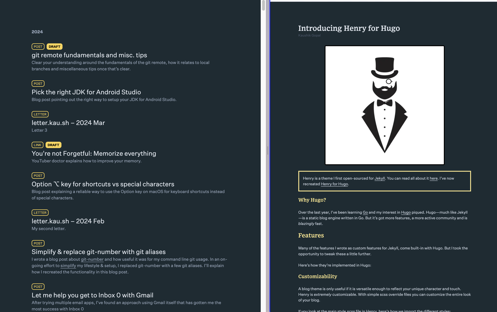

# Henry

<p align="center"></p>

Henry is a [Hugo](https://gohugo.io/) theme with a gorgeous reading experience, chock-full of features. To find out more about all the features check out this [blog post](https://kau.sh/blog/henry-hugo-theme/).

<p align="center"></p>

# Getting Started

These are the instructions for setting up a hugo blog with the Henry theme.

```shell
# 1. Install Hugo
#    https://gohugo.io/getting-started/installing/
brew install hugo

hugo new site blog-henry
cd blog-henry

# 2. clone Henry
git clone https://github.com/kaushikgopal/henry-hugo.git themes/henry
touch assets/css/{output,override,override-fonts}.css
# brew install node # if you don't have npm installed
npm install -D tailwindcss @tailwindcss/cli
npx @tailwindcss/cli -i themes/henry/assets/css/input.css -o ./assets/css/output.css

# 3. configure blog
## add these lines to your hugo.toml config file
theme = "henry"

# 4. run Hugo!

# Option: use a single dev script
# See my blog post on this https://kau.sh/blog/tailwind-hugo#bonus-tip

./bin/dev

# open http://0.0.0.0:1313/

# sample posts are in henry's content folder : themes/henry/content
# if you want to see some samples, just mark them from draft true → false
```

You're good to go. Happy blogging!

Now, whenever you need to get your hugo blog up and running again, just run `./bin/dev`.

## Optional configurations

Here are some recommended customizations to make in your `hugo.toml` config file in addition to what was mentioned above.

### RSS/JSON feed customizations

```toml
## hugo.toml

# enable .json RSS feeds
[outputFormats]
# output formats
# https://gohugo.io/templates/output-formats/#output-format-definitions
[outputFormats.rss]
    mediatype = "application/rss"
    # change RSS path for default XML feed to /feed.xml (default index.xml)
    baseName = "feed"
[outputFormats.json]
    # change RSS path for JSON feed to /feed.json
    baseName = "feed"

# configure RSS feeds for specific pages
[outputs]
# output format for pages
# https://gohugo.io/templates/output-formats/#output-formats-for-pages
    page = ["html"]
    home = ["html", "rss","json"]
    # sections = directories e.g. blog, letters, ppt
    section = ["html","rss","json"]
    # taxonomies = virtual tags/directories e.g. categories, tags (built-in)
    # no rss for these as they're mostly "list" pages
    taxonomy = ["html"]
    # terms = values of taxonomies e.g. categories/programming
    term = ["html", "rss","json"]
```

### Related posts customization

```toml
## hugo.toml
[related]
    includeNewer = true
    threshold = 80
    toLower = true

# weight index distribution tags > categories > title
[[related.indices]]
    name = "tags"
    weight = 80

[[related.indices]]
    name = "categories"
    weight = 20

[[related.indices]]
    name = "title"
    weight = 10
```

# Henry in the Wild

Here are a couple of blogs that use Henry:

1. [Karthick Gopal's blog](https://karthickg.com/blog)
2. [Kaushik Gopal's blog](https://kau.sh/blog)

# License

The theme is available as open source under the terms of the [MIT License](https://opensource.org/licenses/MIT).


_Bug reports and pull requests are welcome on [GitHub](https://github.com/kaushikgopal/henry-hugo). This project is intended to be a safe, welcoming space for collaboration, and contributors are expected to adhere to the [Contributor Covenant](http://contributor-covenant.org) code of conduct._
